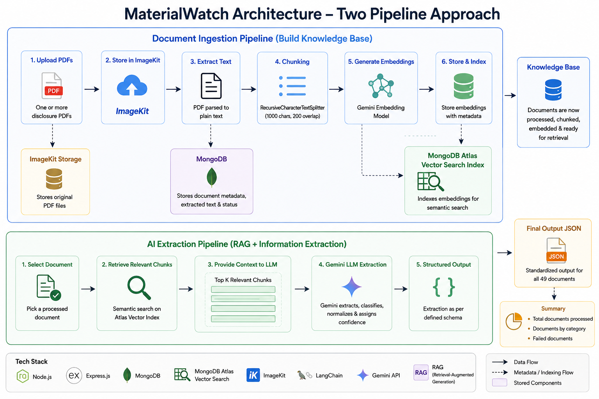

# MaterialWatch

# MaterialWatch

MaterialWatch is an AI-powered document intelligence system that automates the extraction of structured information from corporate disclosure PDFs. Built using a Retrieval-Augmented Generation (RAG) pipeline, it processes uploaded documents through text extraction, semantic chunking, embedding generation, context retrieval, and Gemini-powered information extraction to classify disclosure events and generate standardized JSON outputs. Designed with a modular and scalable architecture, MaterialWatch enables efficient processing of financial documents while ensuring maintainability and extensibility for future enhancements.


---

## How to Run

### 1. Clone the Repository

```bash
git clone <repository-url>
cd MaterialWatch
```

### 2. Install Dependencies

```bash
npm install
```

### 3. Configure Environment Variables

Create a `.env` file in the project root using the following template:

```env
PORT=3000

MONGO_URI=<your_mongodb_connection_string>

GEMINI_API_KEY=<your_gemini_api_key>

IMAGEKIT_PUBLIC_KEY=<your_imagekit_public_key>
IMAGEKIT_PRIVATE_KEY=<your_imagekit_private_key>
IMAGEKIT_URL_ENDPOINT=<your_imagekit_url_endpoint>
```

### 4. Start the Server

```bash
npm run dev
```

The backend will be available at:

```
http://localhost:3000
```

---

## Processing Documents

### Step 1: Upload PDF Documents

```http
POST /api/upload
```

Upload one or more disclosure PDFs using `multipart/form-data` with the field name:

```
files
```

---

### Step 2: Build the Knowledge Base

Process each uploaded document to:

- Extract text from the PDF
- Chunk the text
- Generate Gemini embeddings
- Store embeddings in MongoDB Atlas Vector Search

```http
POST /api/process/:documentId
```

Repeat for all uploaded documents.

---

### Step 3: Run AI Extraction

Process every uploaded document through the RAG extraction pipeline:

```http
POST /api/extraction/run-all
```

---

### Step 4: Generate Final Output

Generate the consolidated extraction results:

```bash
npm run generate-output
```

This produces the final `output.json` containing structured extractions and summary statistics for all processed documents.

## API Reference

| Method | Endpoint | Description |
|--------|----------|-------------|
| `POST` | `/api/upload` | Upload one or more PDF disclosure documents to ImageKit and create document metadata in MongoDB. |
| `POST` | `/api/process/:documentId` | Process an uploaded document by extracting text, creating semantic chunks, generating embeddings, and indexing them for retrieval. |
| `POST` | `/api/extraction/run` | Run the RAG extraction pipeline for a single document and store the structured extraction result. |
| `POST` | `/api/extraction/run-all` | Execute the AI extraction pipeline for all processed documents stored in the database. |
| `GET` | `/api/extraction/:documentId` | Retrieve the structured extraction result for a specific document. |
| `GET` | `/api/documents` | Retrieve metadata and processing status of all uploaded documents. |
| `GET` | `/api/documents/:documentId` | Retrieve metadata for a specific document. |
| `GET` | `/api/health` | Health check endpoint to verify that the backend service is running. |

## Architectural Approach

MaterialWatch is built around a **two-stage Retrieval-Augmented Generation (RAG) architecture** that separates document preprocessing from AI-based information extraction. This design minimizes redundant computation, improves scalability, and keeps each component independently maintainable.

The first stage is the **Document Ingestion Pipeline**, responsible for building a searchable knowledge base from uploaded disclosure PDFs. Documents are uploaded and stored in **ImageKit** for reliable cloud storage, while **MongoDB** maintains document metadata and processing status. Each PDF is parsed into plain text and stored separately from its metadata to keep the data model modular. The extracted text is then divided into overlapping semantic chunks using LangChain's `RecursiveCharacterTextSplitter` (1000-character chunks with 200-character overlap), preserving context across chunk boundaries while remaining within optimal LLM input sizes. Every chunk is converted into a vector embedding using **Gemini Embeddings** and stored in MongoDB. These embeddings are indexed using **MongoDB Atlas Vector Search**, enabling fast semantic retrieval without requiring a dedicated vector database, thereby reducing infrastructure complexity.

The second stage is the **AI Extraction Pipeline**, which performs structured information extraction using the processed knowledge base. Instead of sending an entire document to the language model, the system first retrieves the most semantically relevant chunks through vector search. This retrieved context is supplied to **Gemini** using a Retrieval-Augmented Generation (RAG) workflow, allowing the model to focus only on information relevant to the extraction task. Gemini then classifies the disclosure into one of the predefined event categories, extracts the required entities and financial figures, normalizes values according to the required output schema, assigns an extraction confidence, and produces a standardized JSON object. Finally, results from all processed documents are aggregated into a single output file with summary statistics. By decoupling document preprocessing from AI inference, the architecture remains modular, efficient, and extensible, allowing storage, retrieval, embedding models, or language models to be replaced independently with minimal changes to the overall system.



## Key Tradeoffs

### 1. In-Memory Cosine Similarity instead of Atlas Vector Search
I built and wired up MongoDB Atlas `$vectorSearch` (`vector.service.js`), but retrieval in the actual pipeline (`rag.service.js`) loads every chunk for a document and scores it in plain JavaScript with cosine similarity. At ~49 documents with a handful of chunks each, this is simple, deterministic, and easy to debug — no index-building step to go wrong mid-assignment. It doesn't scale: pulling every chunk into app memory per request falls apart at thousands of documents. With more time, I'd switch retrieval to the already-built `$vectorSearch` path so it becomes a database-side ANN query instead.

### 2. Sequential Batch Processing over Concurrent Extraction
`run-all` processes documents one at a time rather than in parallel. This was deliberate — it avoids hitting Gemini rate limits mid-run and keeps failures traceable to a single document instead of a tangled concurrent stack trace. The cost is wall-clock time: 49 sequential LLM calls is slower than it needs to be. With more time, I'd move to bounded concurrency (a small worker pool, 5–10 in flight) with retry/backoff specifically on rate-limit errors.

### 3. LLM-Based Extraction over Rule-Based Parsing
Given inconsistent BSE/NSE formatting across documents, I used Gemini for both classification and figure extraction instead of writing per-template regex parsers. This trades determinism for robustness — the model generalizes across layout variation that rule-based parsing would need dozens of special cases to handle — but extraction quality is now bounded by prompt quality, and malformed JSON is a real failure mode (currently caught via markdown-fence stripping + a parse-failure path, not schema validation). With more time, I'd add a lightweight rule-based cross-check for the most structurally consistent fields (dates, tickers) rather than trusting the LLM as the sole source.

## Edge Cases

### Edge Cases Handled

- **Invalid or non-PDF uploads:** File type validation ensures that only PDF documents are accepted for processing.
- **Large documents:** Long PDFs are split into overlapping semantic chunks to stay within language model token limits while preserving contextual continuity.
- **Missing or irrelevant fields:** Only fields relevant to the detected disclosure category are populated; all others are returned as `null` to maintain schema consistency.
- **Monetary value normalization:** Financial figures are normalized into the required units (INR or INR crore) before generating the final output.
- **Partial processing failures:** Errors encountered while processing an individual document do not stop batch execution. Failed documents are recorded and reported in the final summary.
- **Duplicate document processing:** Document metadata and processing status are tracked to prevent inconsistent processing states.
- **Low-confidence extractions:** Every extraction includes a confidence level (`high`, `medium`, or `low`) to indicate the model's confidence rather than assuming perfect accuracy.

### Edge Cases Not Handled

- **Scanned or image-only PDFs:** The system assumes machine-readable PDFs and does not currently perform OCR on scanned documents.
- **Password-protected or encrypted PDFs:** Such documents are not supported and will fail during processing.
- **Multi-language disclosures:** The extraction pipeline is designed for English-language disclosures and has not been evaluated on multilingual filings.
- **Complex tables and graphical content:** Information embedded primarily in tables, charts, or images may not be extracted accurately because the pipeline focuses on textual content.
- **Ambiguous disclosures containing multiple event types:** The current implementation assigns a single primary event category and does not support extracting multiple categories from a single document.
- **Malformed or corrupted PDFs:** Files with damaged structures or incomplete content are not explicitly repaired before processing.

## AI Services and External Libraries

| Service / Library | Purpose |
|-------------------|---------|
| **Google Gemini 3.5 Flash** | Used as the primary Large Language Model (LLM) to classify disclosures, extract structured financial information, normalize outputs, and generate the final JSON according to the required schema. |
| **Google Gemini Embeddings (`gemini-embedding-001`)** | Converts document chunks into dense vector embeddings for semantic retrieval within the RAG pipeline. |
| **LangChain** | Provides the `RecursiveCharacterTextSplitter` used for semantic chunking, ensuring documents remain within LLM token limits while preserving contextual continuity. |
| **MongoDB Atlas Vector Search** | Stores and indexes vector embeddings, enabling efficient semantic search without requiring a separate vector database. |
| **MongoDB & Mongoose** | Persist document metadata, extracted text, embeddings, processing status, and extraction results using a structured schema. |
| **Express.js** | Implements the REST API for document upload, processing, extraction, and result retrieval. |
| **Multer** | Handles single and batch PDF uploads through multipart form-data requests. |
| **ImageKit** | Provides cloud storage for uploaded PDF documents, enabling reliable file persistence independent of the application server. |
| **pdf-parse** | Extracts machine-readable text from uploaded PDF documents for downstream processing. |
| **Node.js** | Serves as the runtime environment for the backend application and processing pipelines. |

The selected technologies were chosen to build a lightweight, modular, and production-oriented Retrieval-Augmented Generation (RAG) system while minimizing infrastructure complexity. By combining Gemini for reasoning, LangChain for preprocessing, MongoDB Atlas Vector Search for retrieval, and ImageKit for cloud storage, the system achieves an efficient end-to-end pipeline for processing and extracting structured information from corporate disclosure documents.